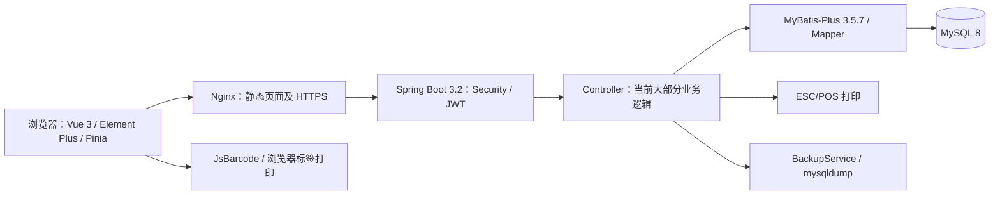

# 华兴服装店系统：后续开发分析基线

分析日期：2026-09-16。范围：当前工作区的文档、前后端源码、建表脚本及部署配置，包含已有未提交改动。本报告不代表线上状态或业务验收结果；下述优化方案均为建议，尚未确认实施。

## 1. 项目定位与结论

这是面向单店、老板与店员共同使用的服装库存和收银系统。已有商品/SKU、扫码收银、库存入库与流水、销售记录、小票和条码打印、用户/分类/尺码设置、备份、销售报表的实现。

当前适合在现有单体架构上继续迭代。最需要优先稳定的是订单金额、库存更新、事务失败语义以及备份恢复。已有页面和接口不能等同于真实业务已验收；尤其旧文档中的 JPA 修复结论不能直接套用到现有 MyBatis-Plus 实现。

## 2. 文档地图与可信边界

| 文档 | 用途 | 当前使用方式 |
|---|---|---|
| `docs/superpowers/specs/2026-07-07-clothing-pos-design.md` | 初始业务范围、数据模型、收银/入库流程 | 业务背景仍有价值；JPA、单 JAR、自动备份描述需对照代码 |
| `docs/superpowers/plans/2026-07-07-clothing-pos-plan.md` | 最初 20 项实施计划 | 视为历史实施路线，不据勾选状态判断当前完成度 |
| `docs/superpowers/task-10-report.md`、`task-11-report.md` | 入库和订单实现历史 | Repository/JPA 细节已过时，尤其并发保护结论 |
| `docs/superpowers/sdd/` 下任务报告与修复报告 | 阶段实现与验证记录 | 只能证明当时记录，不能替代本轮验证 |
| `docs/superpowers/specs/2026-08-06-sales-report-design.md` | 后续销售报表设计 | 已找到对应页面、Controller、Mapper；当前成本口径是明确接受过的限制 |
| `CLAUDE.md`、`DEPLOY.md` | 开发与部署说明 | 部分内容已更新；仍有表数量、部署路径等漂移 |

报表设计引用了 `return-exchange-design`，但当前文件清单未找到对应文档；代码中也未找到退换货、Excel 批量导入的完整业务模块。不能因文档称其为“前置”就认为已完成。

## 3. 当前架构

- 后端：Java 17 编译目标，Spring Boot 3.2.0，Spring Security，JWT，MyBatis-Plus；业务大量放在 Controller，`service` 当前主要为备份服务。
- 前端：Vue 3、TypeScript、Vite、Element Plus、Pinia、Axios；报表使用 ECharts，条码使用 JsBarcode。
- 数据库脚本定义 8 张表：category、product、product_sku、stock_record、sys_order、order_item、sys_user、size_config。尺码配置属于当前未提交改动。
- 商品与 SKU 分开：商品承载名称、分类、进价、售价；SKU 承载颜色、尺码、条码和库存。订单明细、库存流水保存名称和规格快照。
- JWT 过滤器每次根据用户名查询用户并检查 enabled；设置与报表在后端要求 BOSS，其余业务 API 要求已登录。不是仅靠前端菜单隐藏实现权限。
- 当前 Nginx 已配置域名、HTTPS 和证书挂载，超出初版“纯局域网”部署描述。是否已实际部署、是否需要云端访问，尚未验证。

主要入口：`frontend/src/router/index.ts`、`frontend/src/views/`、`src/main/java/com/huaxing/controller/`、`src/main/java/com/huaxing/mapper/`。

## 4. 功能现状

| 模块 | 当前实现 | 后续扩展的主要约束 |
|---|---|---|
| 商品 | CRUD、图片、SKU、条码、尺码选择 | 商品编辑能直接改库存；页面保存通过多个 HTTP 请求完成 |
| 收银 | 扫码、购物车、单品/整单优惠、现金/微信/支付宝标记、找零、打印 | 支付方式目前是记账字段，未发现支付渠道下单/回调链路 |
| 库存 | 查询、批量入库、出入库流水 | 缺少统一库存变更入口与完整失败回滚保障 |
| 销售记录 | 列表、筛选、详情、补打 | 未发现退款/退货状态及处理流程 |
| 系统设置 | 用户、分类、备份；新增尺码管理 | 尺码表升级到已有数据库需单独安排 |
| 报表 | 日/月汇总、趋势、畅销款、分类占比 | 当前成本口径、整单优惠分摊、商品名称分组需明确 |
| 打印 | 后端 ESC/POS；前端标签打印 | 需要真实部署主机和打印机验证；云服务器不能自然访问门店 USB |
| 备份 | 手动备份、列表、下载、保留期清理 | 未发现自动触发或恢复验收；容器依赖未闭合 |

## 5. 核心链路与风险

以下是源码推导的风险，未通过真实数据库并发测试复现。优先级表示建议处理顺序。

### 5.1 优先：库存更新与流水必须同时成功

订单链路：`PosView.vue` → `POST /api/order` → 校验 SKU → 生成单号 → 保存订单 → 扣库存 → 写出库流水 → 保存明细 → 尝试打印 → 返回。

已配置 MyBatis-Plus 乐观锁，SKU 也有 version，但 `OrderController.java:143` 和 `StockController.java:151` 未检查 `updateById` 的受影响行数。如果版本冲突使更新为 0 行，后续代码仍继续写订单或流水。旧报告所依赖的 JPA 乐观锁异常回滚语义不适合作为当前实现的保障。

同一订单传入重复 SKU 也值得专门验证：`OrderController.java:77` 起先预加载每项库存，再逐项更新，重复行可能持有同一旧版本。

建议：让一次库存变更明确返回成功或抛出会回滚的业务异常；订单和库存流水共用事务。后续按用户确认的业务规则选择条件更新或检查乐观锁结果，不必先增加分布式组件。

### 5.2 优先：批量入库失败可能提交前面的数据

`StockController.java:127` 起在同一循环内校验和写库。例：第一项合法并入库，第二项 SKU 不存在，于第 134 行正常返回 HTTP 400。方法没有抛出异常或标记回滚，之前的写入可能正常提交。店员看到失败后整批重试，会再次入库第一项。

建议：先完成全量校验；写入阶段遇到失败必须整体回滚，明确一次提交的原子性。

### 5.3 优先：金额缺少后端权威计算

`OrderController.java:111` 起直接使用请求的订单合计、折扣、应付、实收和找零；第 164 行起直接保存请求的单价、优惠和小计。没有验证这些数值彼此一致。

当前正常页面已存在口径差异：`PosView.vue:283` 起先扣单品优惠，再将明细小计之和作为 totalAmount；初版设计却称 total_amount 为“原价合计”。报表直接汇总该列，因此不能把页面中的销售额当作未打折原价销售额。

建议：先确认改单价权限、单品优惠与整单优惠规则，再由后端计算和校验金额；前端负责即时预览。支付方式标签不等于渠道到账证明。

### 5.4 优先：商品编辑绕过库存流水

`ProductController.java:244` 允许更新 SKU 时直接覆盖 stockQty，未写流水；新增 SKU 的初始库存也直接赋值（第 223 行）。`ProductView.vue:729` 保存普通规格修改时也会提交表单中的库存数。

具体风险：店员打开编辑页时库存为 10，期间卖出 1 件变成 9，随后只改颜色并保存，旧表单仍可能把库存改回 10；后端重新读取的是最新版本，乐观锁不能发现这个“用户表单已过时”的问题。

建议：普通商品编辑与库存调整分开；初始库存、入库、销售及未来退货/盘点统一留痕。是否允许手工调库存及谁能操作，属于下一步业务决策。

### 5.5 优先：订单号生成与请求去重不是同一件事

`OrderController.java:329` 的 synchronized 只包住“查询订单数并返回单号”。真正插入订单在第 119 行，事务提交更晚。两个请求可能在前一单提交前读到相同计数；数据库唯一约束能阻止重复单号落库，但后一个请求会失败，不能称为并发问题已解决。

另未发现创建订单的幂等键或重复请求识别：后端成功而浏览器超时后，再次提交可能创建另一单。

建议分别处理“单号分配唯一性”和“同一收款动作只入账一次”，并以断网/超时重试场景验收。

### 5.6 优先：备份与数据库升级需要补齐交付路径

- `BackupService.java:97` 启动外部 mysqldump，但 `Dockerfile:21` 的运行镜像仅显式安装 curl，未安装 MySQL 客户端。当前镜像定义没有保证备份所需命令存在。
- 初版设计承诺每天首次启动自动备份，当前只找到 `SettingController.java:90` 的手工调用，没有发现启动或定时触发。
- `application-docker.yml:9` 关闭 Spring SQL 初始化；Compose 将 schema/data 脚本挂到 MySQL 首次初始化目录。只改 schema.sql 不能作为已有数据库的升级方案，尤其本次新增 size_config。
- 尚未实际执行备份恢复；“能生成文件”不等于“可恢复营业数据”。商品图片另在 uploads 中，也需要纳入恢复范围。

建议为每次表结构变更提供明确增量 SQL、执行顺序和回退说明，并在隔离数据库验证恢复。

### 5.7 需厘清：删除行为、报表历史口径与商品保存

- 当前 `schema.sql:69` 的 stock_record.sku_id 有外键。正常出入库后删除 SKU 会受到约束；不能仅凭 order_item.sku_id 无外键，就断言正常销售过的商品一定能删除。现网约束是否一致尚未核验。
- `ProductView.vue:709` 起逐次保存商品与 SKU，多个请求不共享一个事务；第 747 行吞掉删除失败，最后仍显示“商品更新成功”。存在部分成功和反馈不准确的问题。
- 报表按当前商品 cost_price 计算历史毛利，这是 8 月设计明确接受的取舍。若后续要求历史利润稳定，才需要重新讨论下单成本快照。
- 汇总毛利以 pay_amount 减成本；畅销款销售额和分类销售额取明细 sub_total，未分摊整单优惠（`ReportMapper.java:52`、第 67 行）。两者不能直接作为同一收入口径对账。
- 畅销款按商品名称合并，同名不同商品会合并、改名后的历史会分组变化。这是现有实现特征，是否调整取决于经营分析需求。

### 5.8 部署和硬件边界

- 前端构建输出在 `frontend/dist`（`vite.config.ts:22`），当前 Docker 由 Nginx 提供页面。旧文档“前端打入 JAR”的构建说明不能直接当作有效流程。
- Vite 开发代理只配置 `/api`，没有 `/uploads`；返回相对图片路径时，开发环境图片访问需要核验。
- Nginx 依赖现有证书文件；通用新机器部署还需要证书初始化步骤。
- 打印发生在订单方法事务返回之前（`OrderController.java:179`）。打印是数据库外部副作用，不能随数据库一起回滚，也可能拉长交易耗时。建议以后明确提交成功后的打印反馈与补打机制。

## 6. 建议的后续工作顺序

1. **确认目标与规则**：下一阶段优先目标、部署与打印位置、金额/历史报表精度。保留当前工作区改动，先确定要继承的开发基线。
2. **稳定交易和库存**：后端金额校验、库存冲突处理、批量回滚、重复请求、单号分配；再处理普通商品编辑覆盖库存。
3. **补齐运行保障**：数据库增量升级、可用备份及恢复、打印结果反馈；同步更新部署和架构文档。
4. **实现选定业务功能**：退换货、盘点、Excel 导入等按业务价值择一推进。退换货依赖订单金额、退回数量、库存回补和报表冲减规则；导入依赖条码唯一性、初始库存与失败回滚规则。
5. **针对实际瓶颈优化**：列表中逐条补查关联数据、报表数据量与索引、前端包体积，再逐步抽取 OrderService/StockService 等业务边界。现阶段没有测量证据支持微服务或缓存改造。

本节是候选路线，用户尚未选择下一阶段范围，不作为开发授权或已确认设计。

## 7. 本轮验证与限制

| 检查 | 结果 | 不能据此证明什么 |
|---|---|---|
| `frontend` 下 `npm run build` | TypeScript 检查及 Vite 构建通过 | 页面交互、真实接口和硬件未验收 |
| `mvn -o -DskipTests compile` | BUILD SUCCESS；输出 Nothing to compile，使用已有增量结果 | 不是 clean 重编译，不是自动化测试通过 |
| 测试目录 | 只发现 `BcryptTest.java` 的 main 调试程序，未找到交易/库存自动化回归套件 | 历史报告中的构建通过不能替代业务回归 |
| 数据库与部署 | 静态读取脚本及配置 | 未连接数据库、未启动容器、未访问线上、未进行真实收付款或打印 |

前端构建有依赖注释警告及大于 500 kB 的 chunk 警告，未阻断构建。主 JS 约 1.24 MB、报表 chunk 约 538 kB（构建显示的压缩前值），可作为后续加载优化线索，但没有实测页面性能结论。

本轮仅新增此分析文档；业务源码未修改。后续新增代码按用户要求标注 `luohuai codeX generate`；修改既有代码标注 `luohuai codeX  modify` 并解释修改原因。

## 8. Grill 第一轮待决策

| 决策 | 建议 | 下一轮由此展开 |
|---|---|---|
| 下一阶段优先目标 | 先保证收银和库存正确，再扩展功能 | 修复范围与验收场景，或选定新功能的规则 |
| 目标使用与部署边界 | 先保持单店、单后端实例；明确后台部署位置及打印机连接位置 | 是否需要远程访问、断网营业、门店打印桥接 |
| 历史报表要求 | 用于正式经营对账时要求金额可核对、历史成本可追溯；已有历史数据明确标记精度边界 | 成本快照、折扣分摊、商品删除与退款冲减 |

这三项确认前，不预设多门店、在线支付、精确成本核算或退换货已纳入实施范围。
